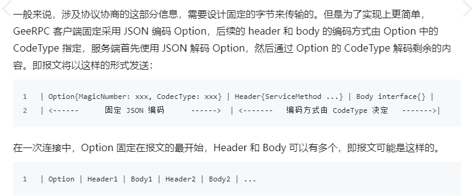

#Day1 服务端与消息编码
1、消息的序列化与反序列化
一个典型的 RPC 调用如下： err = client.Call("Arith.Multiply", args, &reply)
客户端发送的请求包括服务名 Arith，方法名 Multiply，参数 args 三个，服务端的响应包括错误 error，返回值 reply 2 个。

通信过程

服务端的实现
Server
    Accept() 监听
    ServeConn() 监听成功后建立连接
    serveCodec() 主要包含三个阶段
        读取请求 readRequest
        处理请求 handleRequest
        回复请求 sendResponse
main函数
    先启动Server，再启动一个简单的客户端，发送协议交换、消息头和消息体。