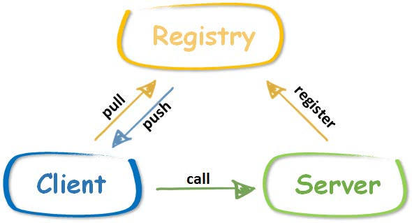

#Day7 服务发现与注册中心(registry)

1、注册中心的位置

    服务端启动后，向注册中心发送注册消息，注册中心得知该服务已经启动，处于可用状态。一般来说，服务端还需要定期向注册中心发送心跳，证明自己还活着。
    客户端向注册中心询问，当前哪天服务是可用的，注册中心将可用的服务列表返回客户端。
    客户端根据注册中心得到的服务列表，选择其中一个发起调用。
    
    当然注册中心的功能还有很多，比如配置的动态同步、通知机制等。
    比较常用的注册中心有 etcd、zookeeper、consul，一般比较出名的微服务或者 RPC 框架，这些主流的注册中心都是支持的。

2、Gee Registry
    GeeRPC 选择自己实现一个简单的支持心跳保活的注册中心。

3、GeeRegistryDiscovery
    在 xclient 中对应实现 Discovery。